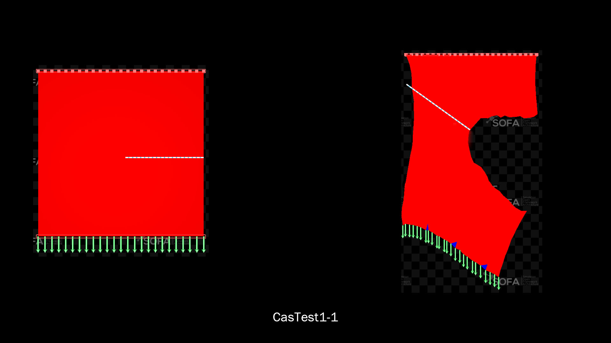

# Tearing

## Description

This code is a SOFA plugin: https://www.sofa-framework.org/ to simulate soft tissue tearing.
Only tearing on triangular surface is supported by default. Volume tearing on tetrahedral mesh need a second plugin called [MeshRefinement ](https://www.sofa-framework.org/applications/marketplace/cutting-mesh-refinement/) and is still work in progress.
Current **TRL** is between 3 and 4. *(4 for surface and 3 for volume tearing)*
All contributions are really welcome.

### Features
- Low level api (c++ methods) is available through the objects ***TearingAlgorithms*** for surface tissue to compute the fracture path from one point to a direction. Similarly ***VolumeTearingAlgorithms***, allows to compute the plan intersection from an elongated tetrahedron. 
- High level API is also available through SOFA components: ***TearingEngine*** and ***VolumeTearingEngine*** which can be used in a SOFA scene and will detect the fracture point and direction given a FEM component which compute the element stress.
- Several Data are useful to control the fracture, such as: 
  - seuilStress: threshold value for element stress which will mark this element as fractured
  - fractureMaxLength: maximum length of a fracture per simulation step
  - nbFractureMax: maximum number of fracture for the simulation.
- Several scenario using the engine are provided inside the examples scenes and corresponding result screenshots are available inside the doc folder.

### Architecture
- **doc:** 
	- Documentation and screenshots of the scenario as well as piepline schemes.
- **scenes:**
    - TearingEngine_scenes: ***TearingEngine*** test cases as well as scenario with predefined fracture inputs.
    - VolumeTearingEngine_scenes: ***VolumeTearingEngine*** demo cases.
- **src/tearing:**
	- source code of the two SOFA engines: ***TearingEngine*** and ***VolumeTearingEngine*** to be used inside SOFA simulaiton scene as well as their c++ API: ***TearingAlgorithms*** and ***VolumeTearingAlgorithms***.

## Installation
This plugin should be added as an external plugin of SOFA using the CMAKE_EXTERNAL_DIRECTORIES CMake variable of SOFA. 
See SOFA documentation for more information

## License
This work is dual-licensed under either [GPL](https://github.com/InfinyTech3D/Tearing/blob/main/LICENSE.md) or Commercial License. 
For commercial license request, please contact us by email at contact@infinytech3d.com

